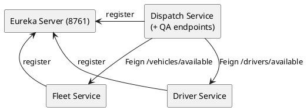

# Fleet Microservices Project

A Spring Boot microservices application for fleet management, demonstrating service discovery (Eureka), inter-service communication (Feign), and data persistence (MongoDB).

## Architecture



## Prerequisites

- Java 17+
- Maven
- MongoDB running locally on port `27017`

## Modules

1. **eureka-server**: Service Registry.
2. **fleet-service**: Manages Vehicles.
3. **driver-service**: Manages Drivers.
4. **dispatch-service**: Manages Jobs and orchestration.

## Running the Application

Since there is no Docker setup, you must run the applications locally using Maven or your IDE.

If you do not have `mvn` installed globally, use the provided wrapper: `.\mvnw` (Windows) or `./mvnw` (Linux/Mac).

**Execution Order:**
1. **MongoDB**: Ensure it is running (`mongod` or similar).
2. **eureka-server**:
   ```powershell
   cd eureka-server
   ..\mvnw spring-boot:run
   ```
   Wait for it to start on port 8761.
3. **fleet-service**:
   ```powershell
   cd fleet-service
   ..\mvnw spring-boot:run
   ```
4. **driver-service**:
   ```powershell
   cd driver-service
   ..\mvnw spring-boot:run
   ```
5. **dispatch-service**:
   ```powershell
   cd dispatch-service
   ..\mvnw spring-boot:run
   ```

## 🖥️ Web Dashboard (UI)

A modern, dark-themed dashboard is included in the `fleet-ui` folder.

1.  Ensure all services are running (wait for them to start).

## 4. Run the Web UI (FleetWave) ✨
This project includes a modern Vue 3 frontend named **FleetWave**.

1. **Navigate**: `cd fleet-wave`
2. **Install**: `npm install`
3. **Run**: `npm run dev`
4. **Open**: [http://localhost:5173](http://localhost:5173)

## QA / Testing Scenarios

The **Dispatch Service** includes QA endpoints to easily test the interaction between services.

### 1. Seed & Engine Failure Scenario
This single call will:
- Create a random AVAILABLE TRUCK in Fleet Service.
- Create a random AVAILABLE HLV Driver in Driver Service.
- Create a Job in Dispatch Service (assigning the truck/driver).
- Trigger a breakdown event.
- Return the job status before (ASSIGNED) and after (REASSIGN_PENDING).

```bash
curl -X POST http://localhost:<DISPATCH_PORT>/qa/scenario/engine-fail
```

*(Note: Replace `<DISPATCH_PORT>` with the actual port Dispatch Service started on, check logs for `Tomcat started on port ...`)*

### 2. Manual Endpoints

**Create Vehicle:**
```bash
curl -X POST http://localhost:<FLEET_PORT>/vehicles \
  -H "Content-Type: application/json" \
  -d '{"plate":"KA-01-1234", "type":"TRUCK", "status":"AVAILABLE"}'
```

**Create Driver:**
```bash
curl -X POST http://localhost:<DRIVER_PORT>/drivers \
  -H "Content-Type: application/json" \
  -d '{"name":"John Doe", "licenseClass":"HLV", "availability":true, "rating":4.5}'
```

**Create Job (Trigger Assignment):**
```bash
curl -X POST http://localhost:<DISPATCH_PORT>/jobs \
  -H "Content-Type: application/json" \
  -d '{"pickup":"Loc-A", "dropoff":"Loc-B", "vehicleType":"TRUCK", "licenseClass":"HLV"}'
```
